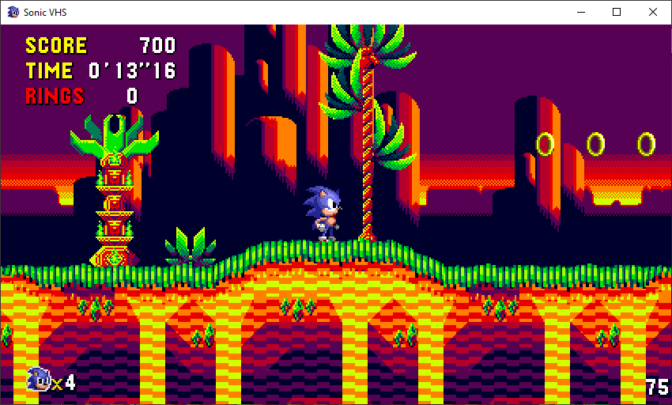
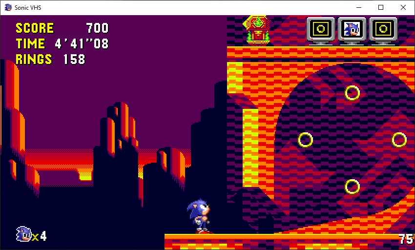
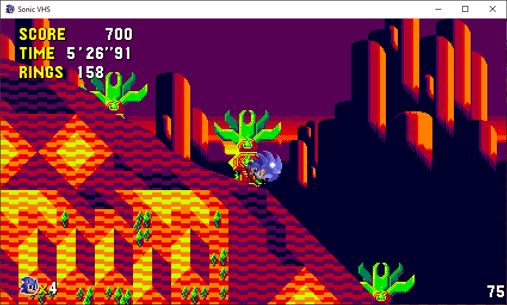

# Screenshots







# How to build

### Windows

Prerequisites: Visual Studio 2022

1. Open the Visual Studio solution file
2. Hit F5 to run the project

### Linux / Mac

Prerequisites: CMake, pkg-config, SDL2, SDL2_mixer, Freetype2

1. Navigate to the root of the repo
2. Use CMake to build:

```
cd CppSonic2
cmake -S . -B build
cmake --build build --parallel
```

3. To run the project:
```
./build/CppSonic2
```
